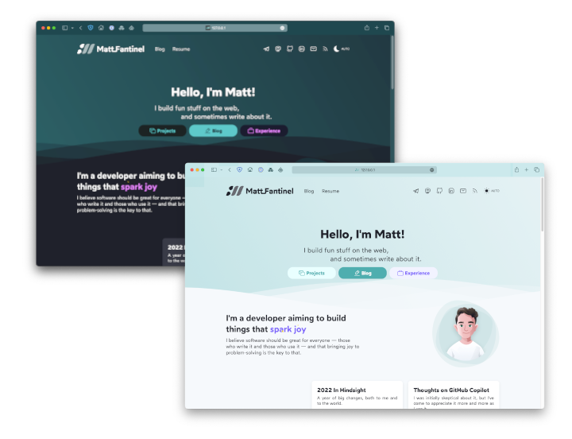

# matfantinel.github.io / fantinel.dev

This is my own personal website, built with SvelteKit. It also holds my own personal blog.

<p align="center">
    
</p>

It was built with a few goals in mind:

- Responsive design: the website looks and behaves well on screens of all sizes;
- Fast: it only loads what's needed for it to work;
- Adaptive: it supports dark mode from most operating systems by default (desktop and mobile);
- Privacy-friendly: I don't need to know who you are and what you do. It uses [Plausible](https://plausible.io/) instead of Google Analytics;
- Pretty: have a pleasant design that is both accessible and pleasing to the eye.

I achieved this with the help of SvelteKit. There is almost no JavaScript running, and it actually works with JS disabled! While JS is awesome, it's important to know when it's not needed.

# Building & Running Locally

This website is powered by SvelteKit. As of this time, SvelteKit is currently in beta, but its API is stable enough to use it.

To run it locally, you simply have to run:

```shell
# First, install dependencies
npm install
# Then, run it on dev mode
npm run dev
```

The site should now be available at http://localhost:5173/ on your local machine, and your local machine's IP address on your network—great for testing on mobile OSes.

# Histoire / Storybook

I've used [Histoire](https://histoire.dev), a Vite-based Storybook alternative to be able to see and develop components in isolation. To open it, run `npm run story:dev`.

# Images

I use [vite-imagetools](https://github.com/JonasKruckenberg/imagetools) to automatically process images, generating webp, avif and png files for each one of them. Just by importing the images on a Svelte/Markdown file, Vite will automatically process those on build. I've created the `getSrcsetFromImport` function and the `SrcsetImage` component to make it easier to use.

# Managing Posts

All posts are Markdown files that are processed with [MDsveX](https://mdsvex.pngwn.io/) to allow using Svelte components inside them. In order to make it easier to manage posts, I highly recommend the [Front Matter VS Code extension](https://frontmatter.codes/), which gives you a nice CMS-like UI.

# Hosting

This site is hosted on [Vercel](https://vercel.com/), and uses SvelteKit's `adapter-auto` on build. It can also be generated as a static site, and hosted pretty much anywhere. To do that, simply replace `adapter-auto` with `adapter-static` on `svelte.config.js` and `package.json` (and re-run `npm install`).