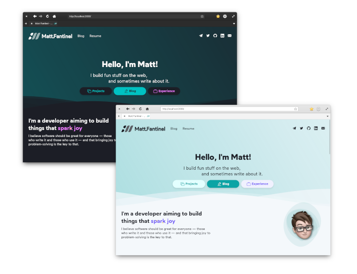

# matfantinel.github.io / fantinel.dev

This is my own personal website, built with SvelteKit. It also holds my own personal blog.


<p align="center">
    
</p>


It was built with a few goals in mind:

* Responsive design: the website looks and behaves well on screens of all sizes;
* Fast: it only loads what's needed for it to work;
* Adaptive: it supports dark mode from most operating systems by default (desktop and mobile);
* Privacy-friendly: I don't need to know who you are and what you do. It uses [Plausible](https://plausible.io/) instead of Google Analytics;
* Pretty: have a pleasant design that is both accessible and pleasing to the eye.

I achieved this with the help of SvelteKit. There is almost no JavaScript running, and it actually works with JS disabled! While JS is awesome, it's important to know when it's not needed.

# Building & Running Locally

This website is powered by SvelteKit. As of this time, SvelteKit is currently in beta, but its API is stable enough to use it.

To run it locally, you simply have to run:

```shell
# First, install dependencies
npm install
# Then, run it on dev mode
npm run dev
```

The site should now be available at http://0.0.0.0:3000/ on your local machine, and your local machine's IP address on your network—great for testing on mobile OSes.

# Optimizing images

I've built an image-optimizer script called [image-transmutation](https://github.com/matfantinel/image-transmutation) that is used on this website. For now, you have to run it manually, while I don't push it to npm.

On the image-transmutation project folder, run:

```shell
node ./index.js --run --sourceFolder "{YOUR_PROJECT_FOLDER}/static/images" --targetFolder "{YOUR_PROJECT_FOLDER}/static/optimized-images" --inputFormats "jpg" --inputFormats "jpeg" --inputFormats "png" --outputFormats "webp" --outputFormats "avif" --outputFormats "png"
```