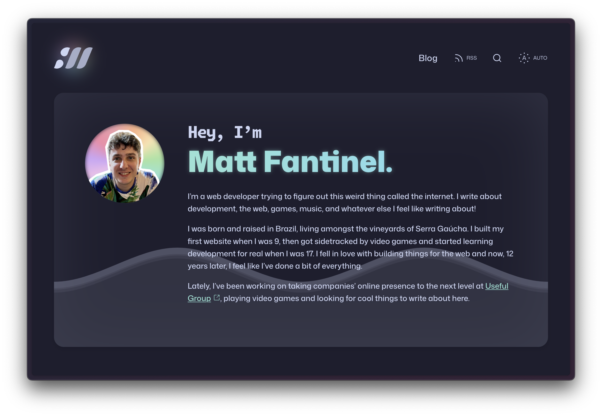

> [!NOTE] Forking discouraged!
>
> This website is a work in progress and has some stuff that is very specific to my use case. I don't recommend forking it yet if you want to build your own.
> 
> In the spirit of open source, I'm building it in public. If you still want to use it as a base, at least make sure to remove my name, logo and pictures from it.

> [!NOTE] Looking for the SvelteKit version?
>
> This website was previously built with SvelteKit. If you're looking for that, check the [v4 branch](https://github.com/matfantinel/fantinel.dev/tree/v4). If you're looking for a SvelteKit template to use as a starting point, check out [my public SvelteKit blog template](https://github.com/matfantinel/sveltekit-static-blog-template).

# fantinel.dev

This is my own personal website, built with Astro and Svelte. It also holds my own personal blog.

<p align="center">
    
</p>

It was built with a few goals in mind:

- Responsive design: the website looks and behaves well on screens of all sizes;
- Fast: it only loads what's needed for it to work;
- Adaptive: it supports dark mode from most operating systems by default (desktop and mobile);
- Privacy-friendly: I don't need to know who you are and what you do. It uses [Plausible](https://plausible.io/) instead of Google Analytics;
- Pretty: have a pleasant design that is both accessible and pleasing to the eye.

I achieved this with the help of Astro and Svelte. There is almost no JavaScript running, and it actually works with JS disabled! While JS is awesome, it's important to know when it's not needed.

# Content Management

This website includes no content, and it **currently requires some content to be used**. Since the content is personal and [I don't want to have it on the repo](https://fantinel.dev/separating-content-from-code), you'll probably struggle to get it to work for now. I plan to make it easier to use in the future.

My "CMS" is just a bunch of Markdown files and a YAML file with some metadata. I use Obsidian to manage the content.

# Building & Running Locally

To run it locally, you simply have to run:

```shell
# First, install dependencies
npm install
# Then, run it on dev mode
npm run dev
```

The site should now be available at http://localhost:4321/ on your local machine, and your local machine's IP address on your network—great for testing on mobile OSes.

# Storybook

I use Storybook to develop components in isolation. To open it, run `npm run storybook`.

# Hosting

This site is hosted on [Vercel](https://vercel.com/), and uses Astro's `@astrojs/vercel` adapter on build. It can also be generated as a static site, and hosted pretty much anywhere.

# Markdown Syntax

I've recently updated the Markdown syntax to match [Obsidian's](https://help.obsidian.md/Editing+and+formatting/Basic+formatting+syntax). With a few added goodies.

| Effect | Syntax | Example |
| ---- | ---- | ---- |
| Bold | ** or __ | \*\*example\*\* |
| Italic | * or _ | \*example\* |
| Strikethrough | ~~ | \~\~example\~\~ |
| Highlight | == | \=\=example\=\= |
| Links | \[\]\(\) | \[text\]\(url\) |
| Blockquotes | \> | \> Quote |
| Sparkling Highlight | @@ | \@\@example\@\@ |
| Button | \[text\](url 'button prop=value') | \[Example\](url 'button color=secondary href=url') |
| Callout | > \[!type\] | > \[!info\]<br>> Example |
| Image | !\[Alt text \|\| custom-class\](url 'figcaption') | !\[Example image \|\| full-bleed\](/test.jpg 'A sample image'\]
