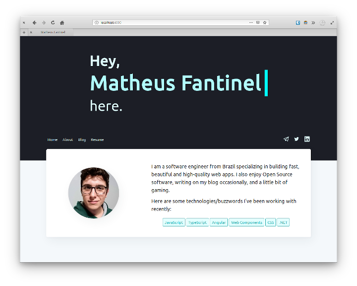

# matfantinel.github.io / fantinel.dev

This is my own personal website, built with Jekyll. It also holds my own personal blog.


<p align="center">
    
</p>


It was built with a few goals in mind:

* Responsive design: the website looks and behaves well on screens of all sizes;
* Fast: it only loads what's needed for it to work. No external JS or CSS libraries:
* Adaptive: it supports dark mode from most operating systems by default (desktop and mobile);
* No tracking: I don't need to know who you are and what you do. No tracking nor analytics;
* Pretty: use a simple and organized layout with simple animations to provide a pleasant experience to all visitors.

I achieved this with the help of Jekyll and SASS. There is little to no JavaScript. While JS is awesome, it's important to know when it's not needed.

# Inspirations

* Thanks to [Jekyll Now](https://github.com/barryclark/jekyll-now) for providing the base for this project;
* Thanks to the elementary OS team for publishing [their own blog's code](https://github.com/elementary/blog-template) for me to use as inspiration for the code;
* This website's looks are inspired by [Ghost.org](https://ghost.org)'s [Casper theme](https://github.com/TryGhost/Casper).


# Building & Running Locally

The blog is a simple Jekyll-powered site hosted by GitHub Pages. To run it locally, see [the GitHub docs](https://help.github.com/articles/setting-up-your-github-pages-site-locally-with-jekyll/).

### Serve

```shell
bundle exec jekyll serve --host 0.0.0.0
```

The site should now be available at http://0.0.0.0:4000/ on your local machine, and your local machine's IP address on your network—great for testing on mobile OSes.